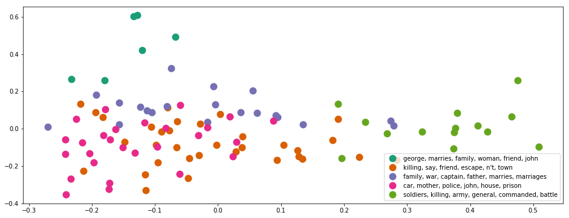
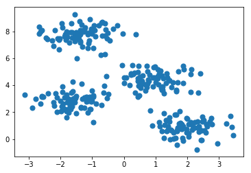
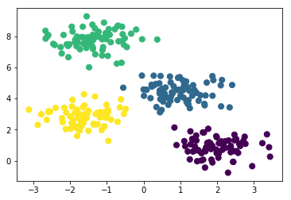

# Document Clustering and Topic Modeling

In this project, I use unsupervised learning models to cluster unlabeled documents into different groups, visualize the results and identify their latent topics/structures.

## Contents

<ul>
<li>[Part 1: Load Data](#Part-1:-Load-Data)
<li>[Part 2: Tokenizing and Stemming](#Part-2:-Tokenizing-and-Stemming)
<li>[Part 3: TF-IDF](#Part-3:-TF-IDF)
<li>[Part 4: K-means clustering](#Part-4:-K-means-clustering)
<li>[Part 5: Topic Modeling - Latent Dirichlet Allocation](#Part-5:-Topic-Modeling---Latent-Dirichlet-Allocation)
</ul>

# Part 1: Load Data


```python
import warnings
warnings.filterwarnings('ignore')
import numpy as np
import pandas as pd
import nltk
import re
import os

from sklearn import decomposition
from sklearn.feature_extraction.text import TfidfVectorizer
import matplotlib.pyplot as plt
import lda
```

Read data from files. In summary, we have 100 titles and 100 synoposes (combined from imdb and wiki).


```python
#import three lists: titles and wikipedia synopses
titles = open('input/title_list.txt').read().split('\n')
titles = titles[:100] #ensures that only the first 100 are read in

#The wiki synopses and imdb synopses of each movie is seperated by the keywords "BREAKS HERE". 
#Each synoposes may consist of multiple paragraphs.
synopses_wiki = open('input/synopses_list_wiki.txt').read().split('\n BREAKS HERE')
synopses_wiki = synopses_wiki[:100]

synopses_imdb = open('input/synopses_list_imdb.txt').read().split('\n BREAKS HERE')
synopses_imdb = synopses_imdb[:100]

#Combine imdb and wiki to get full synoposes for the top 100 movies. 
synopses = []
for i in range(len(synopses_wiki)):
    item = synopses_wiki[i] + synopses_imdb[i]
    synopses.append(item)
    
#Because these synopses have already been ordered in popularity order, 
#just need to generate a list of ordered numbers for future usage.
ranks = range(len(titles))
```

# Part 2: Tokenizing and Stemming

Load stopwords and stemmer function from NLTK library.
Stop words are words like "a", "the", or "in" which don't convey significant meaning.
Stemming is the process of breaking a word down into its root.


```python
# Use nltk's English stopwords.
stopwords = nltk.corpus.stopwords.words('english')

print("We use " + str(len(stopwords)) + " stop-words from nltk library.")
print(stopwords[:10])
```

    We use 153 stop-words from nltk library.
    ['i', 'me', 'my', 'myself', 'we', 'our', 'ours', 'ourselves', 'you', 'your']


```python
from nltk.stem.snowball import SnowballStemmer
stemmer = SnowballStemmer("english")

def tokenization_and_stemming(text):
    tokens = [word.lower() for sent in nltk.sent_tokenize(text) for word in nltk.word_tokenize(sent) if word not in stopwords]
#     tokens=[]
#     for sent in nltk.sent_tokenize(text):
#         for word in nltk.word_tokenize(sent):
#             if word not in stopwords:
#                 tokens.append(word);   
    filtered_tokens = []
    # filter out any tokens not containing letters (e.g., numeric tokens, raw punctuation)
    for token in tokens:
        if re.search('[a-zA-Z]', token):
            filtered_tokens.append(token)
    stems = [stemmer.stem(t) for t in filtered_tokens]
    return stems

def tokenization(text):
    tokens = [word.lower() for sent in nltk.sent_tokenize(text) for word in nltk.word_tokenize(sent) if word not in stopwords]
    filtered_tokens = []
    for token in tokens:
        if re.search('[a-zA-Z]', token):
            filtered_tokens.append(token)
    return filtered_tokens
```


```python
tokenization_and_stemming("she looked at her father's arm.")
```


    ['look', 'father', "'s", 'arm']


Use the defined functions to analyze (i.e. tokenize, stem) our synoposes.


```python
docs_stemmed = []
docs_tokenized = []
for i in synopses:
    tokenized_and_stemmed_results = tokenization_and_stemming(i)
    docs_stemmed.extend(tokenized_and_stemmed_results)
    
    tokenized_results = tokenization(i)
    docs_tokenized.extend(tokenized_results)
```

Create a mapping from stemmed words to original tokenized words for result interpretation.


```python
vocab_frame_dict = {docs_stemmed[x]:docs_tokenized[x] for x in range(len(docs_stemmed))}
print(vocab_frame_dict['angel'])
```

    angeles


# Part 3: TF-IDF


```python
#define vectorizer parameters
tfidf_model = TfidfVectorizer(max_df=0.8, max_features=200000,
                                 min_df=0.2, stop_words='english',
                                 use_idf=True, tokenizer=tokenization_and_stemming, ngram_range=(1,1))

tfidf_matrix = tfidf_model.fit_transform(synopses) #fit the vectorizer to synopses

print("In total, there are " + str(tfidf_matrix.shape[0]) + \
      " synoposes and " + str(tfidf_matrix.shape[1]) + " terms.")
```

    In total, there are 100 synoposes and 538 terms.


```python
tfidf_model.get_params()
```


    {'analyzer': 'word',
     'binary': False,
     'decode_error': 'strict',
     'dtype': numpy.int64,
     'encoding': 'utf-8',
     'input': 'content',
     'lowercase': True,
     'max_df': 0.8,
     'max_features': 200000,
     'min_df': 0.2,
     'ngram_range': (1, 1),
     'norm': 'l2',
     'preprocessor': None,
     'smooth_idf': True,
     'stop_words': 'english',
     'strip_accents': None,
     'sublinear_tf': False,
     'token_pattern': '(?u)\\b\\w\\w+\\b',
     'tokenizer': <function __main__.tokenization_and_stemming(text)>,
     'use_idf': True,
     'vocabulary': None}


Save the terms identified by TF-IDF.


```python
tf_selected_words = tfidf_model.get_feature_names()
```

# Calculate Document Similarity


```python
from sklearn.metrics.pairwise import cosine_similarity
cos_matrix = cosine_similarity(tfidf_matrix)
print(cos_matrix)
```

    [[1.         0.1996283  0.23342595 ... 0.3581728  0.3277855  0.17714484]
     [0.1996283  1.         0.26626879 ... 0.26910321 0.22856581 0.10870124]
     [0.23342595 0.26626879 1.         ... 0.27738654 0.24669308 0.12805055]
     ...
     [0.3581728  0.26910321 0.27738654 ... 1.         0.55040973 0.08151334]
     [0.3277855  0.22856581 0.24669308 ... 0.55040973 1.         0.13005234]
     [0.17714484 0.10870124 0.12805055 ... 0.08151334 0.13005234 1.        ]]


# Part 4: K-means clustering


```python
from sklearn.cluster import KMeans

num_clusters = 5
km = KMeans(n_clusters=num_clusters)
km.fit(tfidf_matrix)
clusters = km.labels_.tolist()
```

## 4.1. Analyze K-means Result


```python
# create DataFrame films from all of the input files.
films = { 'title': titles, 'rank': ranks, 'synopsis': synopses, 'cluster': clusters}
frame = pd.DataFrame(films, index = [clusters] , columns = ['rank', 'title', 'cluster'])
```


```python
frame.head(10)
```


<div>
<style scoped>
    .dataframe tbody tr th:only-of-type {
        vertical-align: middle;
    }

    .dataframe tbody tr th {
        vertical-align: top;
    }

    .dataframe thead th {
        text-align: right;
    }
</style>
<table border="1" class="dataframe">
  <thead>
    <tr style="text-align: right;">
      <th></th>
      <th>rank</th>
      <th>title</th>
      <th>cluster</th>
    </tr>
  </thead>
  <tbody>
    <tr>
      <th>2</th>
      <td>0</td>
      <td>The Godfather</td>
      <td>2</td>
    </tr>
    <tr>
      <th>3</th>
      <td>1</td>
      <td>The Shawshank Redemption</td>
      <td>3</td>
    </tr>
    <tr>
      <th>2</th>
      <td>2</td>
      <td>Schindler's List</td>
      <td>2</td>
    </tr>
    <tr>
      <th>1</th>
      <td>3</td>
      <td>Raging Bull</td>
      <td>1</td>
    </tr>
    <tr>
      <th>1</th>
      <td>4</td>
      <td>Casablanca</td>
      <td>1</td>
    </tr>
    <tr>
      <th>1</th>
      <td>5</td>
      <td>One Flew Over the Cuckoo's Nest</td>
      <td>1</td>
    </tr>
    <tr>
      <th>2</th>
      <td>6</td>
      <td>Gone with the Wind</td>
      <td>2</td>
    </tr>
    <tr>
      <th>2</th>
      <td>7</td>
      <td>Citizen Kane</td>
      <td>2</td>
    </tr>
    <tr>
      <th>1</th>
      <td>8</td>
      <td>The Wizard of Oz</td>
      <td>1</td>
    </tr>
    <tr>
      <th>3</th>
      <td>9</td>
      <td>Titanic</td>
      <td>3</td>
    </tr>
  </tbody>
</table>
</div>


```python
print("Number of films included in each cluster:")
frame['cluster'].value_counts().to_frame()
```

    Number of films included in each cluster:


<div>
<style scoped>
    .dataframe tbody tr th:only-of-type {
        vertical-align: middle;
    }

    .dataframe tbody tr th {
        vertical-align: top;
    }

    .dataframe thead th {
        text-align: right;
    }
</style>
<table border="1" class="dataframe">
  <thead>
    <tr style="text-align: right;">
      <th></th>
      <th>cluster</th>
    </tr>
  </thead>
  <tbody>
    <tr>
      <th>1</th>
      <td>33</td>
    </tr>
    <tr>
      <th>3</th>
      <td>27</td>
    </tr>
    <tr>
      <th>2</th>
      <td>20</td>
    </tr>
    <tr>
      <th>4</th>
      <td>14</td>
    </tr>
    <tr>
      <th>0</th>
      <td>6</td>
    </tr>
  </tbody>
</table>
</div>


```python
grouped = frame['rank'].groupby(frame['cluster'])
print("Average rank (1 to 100) per cluster:")
grouped.mean().to_frame()
```

    Average rank (1 to 100) per cluster:


<div>
<style scoped>
    .dataframe tbody tr th:only-of-type {
        vertical-align: middle;
    }

    .dataframe tbody tr th {
        vertical-align: top;
    }

    .dataframe thead th {
        text-align: right;
    }
</style>
<table border="1" class="dataframe">
  <thead>
    <tr style="text-align: right;">
      <th></th>
      <th>rank</th>
    </tr>
    <tr>
      <th>cluster</th>
      <th></th>
    </tr>
  </thead>
  <tbody>
    <tr>
      <th>0</th>
      <td>52.833333</td>
    </tr>
    <tr>
      <th>1</th>
      <td>48.060606</td>
    </tr>
    <tr>
      <th>2</th>
      <td>51.700000</td>
    </tr>
    <tr>
      <th>3</th>
      <td>53.925926</td>
    </tr>
    <tr>
      <th>4</th>
      <td>39.785714</td>
    </tr>
  </tbody>
</table>
</div>


```python
print("<Document clustering result by K-means>")

#km.cluster_centers_ denotes the importances of each items in centroid.
#We need to sort it in decreasing-order and get the top k items.
order_centroids = km.cluster_centers_.argsort()[:, ::-1] 

Cluster_keywords_summary = {}
for i in range(num_clusters):
    print("Cluster " + str(i) + " words:" ,)
    Cluster_keywords_summary[i] = []
    for ind in order_centroids[i, :6]: #replace 6 with n words per cluster
        Cluster_keywords_summary[i].append(vocab_frame_dict[tf_selected_words[ind]])
        print(vocab_frame_dict[tf_selected_words[ind]] + ",")
    print
    #Here ix means index, which is the clusterID of each item.
    #Without tolist, the values result from dataframe is <type 'numpy.ndarray'>
    cluster_movies = frame.ix[i]['title'].values.tolist()
    print("Cluster " + str(i) + " titles (" + str(len(cluster_movies)) + " movies): " )
    print(", ".join(cluster_movies))
```

    <Document clustering result by K-means>
    Cluster 0 words:
    george,
    marries,
    family,
    woman,
    friend,
    john,
    Cluster 0 titles (6 movies): 
    It's a Wonderful Life, The Philadelphia Story, An American in Paris, The King's Speech, A Place in the Sun, Tootsie
    Cluster 1 words:
    killing,
    say,
    friend,
    escape,
    n't,
    town,
    Cluster 1 titles (33 movies): 
    Raging Bull, Casablanca, One Flew Over the Cuckoo's Nest, The Wizard of Oz, The Godfather: Part II, On the Waterfront, West Side Story, Star Wars, 2001: A Space Odyssey, The Silence of the Lambs, Chinatown, 12 Angry Men, Gandhi, Unforgiven, Raiders of the Lost Ark, Rocky, To Kill a Mockingbird, Jaws, The Good, the Bad and the Ugly, Butch Cassidy and the Sundance Kid, High Noon, The Deer Hunter, Mr. Smith Goes to Washington, Annie Hall, Shane, Nashville, Stagecoach, The Maltese Falcon, Taxi Driver, Wuthering Heights, Double Indemnity, Rear Window, The Third Man
    Cluster 2 words:
    family,
    war,
    captain,
    father,
    marries,
    marriages,
    Cluster 2 titles (20 movies): 
    The Godfather, Schindler's List, Gone with the Wind, Citizen Kane, The Sound of Music, Amadeus, A Streetcar Named Desire, The Best Years of Our Lives, Doctor Zhivago, The Pianist, City Lights, It Happened One Night, Out of Africa, Good Will Hunting, Terms of Endearment, Giant, Network, The African Queen, Mutiny on the Bounty, Yankee Doodle Dandy
    Cluster 3 words:
    car,
    mother,
    police,
    john,
    house,
    prison,
    Cluster 3 titles (27 movies): 
    The Shawshank Redemption, Titanic, Psycho, Sunset Blvd., Vertigo, Forrest Gump, E.T. the Extra-Terrestrial, Singin' in the Rain, Some Like It Hot, My Fair Lady, Ben-Hur, The Apartment, Goodfellas, The Exorcist, The French Connection, Midnight Cowboy, Rain Man, Fargo, The Grapes of Wrath, The Green Mile, Close Encounters of the Third Kind, The Graduate, American Graffiti, Pulp Fiction, A Clockwork Orange, Rebel Without a Cause, North by Northwest
    Cluster 4 words:
    soldiers,
    killing,
    army,
    general,
    commanded,
    battle,
    Cluster 4 titles (14 movies): 
    Lawrence of Arabia, The Bridge on the River Kwai, Dr. Strangelove or: How I Learned to Stop Worrying and Love the Bomb, Apocalypse Now, The Lord of the Rings: The Return of the King, Gladiator, From Here to Eternity, Saving Private Ryan, Patton, Braveheart, The Treasure of the Sierra Madre, Platoon, Dances with Wolves, All Quiet on the Western Front


## 4.2. Plot K-means Result


```python
pca = decomposition.PCA(n_components=2)
tfidf_matrix_np=tfidf_matrix.toarray()
pca.fit(tfidf_matrix_np)
X = pca.transform(tfidf_matrix_np)

xs, ys = X[:, 0], X[:, 1]

#set up colors per clusters using a dict
cluster_colors = {0: '#1b9e77', 1: '#d95f02', 2: '#7570b3', 3: '#e7298a', 4: '#66a61e'}
#set up cluster names using a dict
cluster_names = {}
for i in range(num_clusters):
    cluster_names[i] = ", ".join(Cluster_keywords_summary[i])
```


```python
%matplotlib inline 

#create data frame with PCA cluster results
df = pd.DataFrame(dict(x=xs, y=ys, label=clusters, title=titles)) 
groups = df.groupby(clusters)

# set up plot
fig, ax = plt.subplots(figsize=(16, 6))
#Set color for each cluster/group
for name, group in groups:
    ax.plot(group.x, group.y, marker='o', linestyle='', ms=12, 
            label=cluster_names[name], color=cluster_colors[name], 
            mec='none')

ax.legend(numpoints=1,loc=4)  #show legend with only 1 point, position is right bottom.

plt.show() #show the plot
```





```python
plt.close()
```

# Part 5: Topic Modeling - Latent Dirichlet Allocation


```python
#Now use synopses to build a 100*551 matrix (terms)
terms_dict = {tf_selected_words[x]:x for x in range(len(tf_selected_words))}

feature_matrix_synopses_tf = []
for i in synopses:
    current_doc_stats = [0] * len(tf_selected_words)
    allwords_stemmed = tokenization_and_stemming(i)
    for get_terms in allwords_stemmed:
        if get_terms in tf_selected_words:
            current_doc_stats[terms_dict[get_terms]] += 1
    current_doc_stats = np.asarray(current_doc_stats)
    feature_matrix_synopses_tf.append(current_doc_stats)
    
feature_matrix_synopses_tf = np.asarray(feature_matrix_synopses_tf)
```


```python
model = lda.LDA(n_topics=5, n_iter=500, random_state=1)
```

<li> "model.topic_word_" saves the importance of tf_selected_words in LDA model, i.e. words similarity matrix
<li> The shape of "model.topic_word_" is (n_topics,num_of_selected_words)
<li> "model.doc_topic_" saves the document topic results, i.e. document topic matrix.
<li> The shape of "model.doc_topic_" is (num_of_documents, n_topics)


```python
model.fit(feature_matrix_synopses_tf)
topic_word = model.topic_word_  # model.components_ also works
n_top_words = 7

topic_keywords_list = []
for i, topic_dist in enumerate(topic_word):
    #Here we select top(n_top_words-1)
    lda_topic_words = np.array(tf_selected_words)[np.argsort(topic_dist)][:-n_top_words:-1] 
    for j in range(len(lda_topic_words)):
        lda_topic_words[j] = vocab_frame_dict[lda_topic_words[j]]
    topic_keywords_list.append(lda_topic_words.tolist())
```

    INFO:lda:n_documents: 100
    INFO:lda:vocab_size: 538
    INFO:lda:n_words: 61218
    INFO:lda:n_topics: 5
    INFO:lda:n_iter: 500
    INFO:lda:<0> log likelihood: -484683
    INFO:lda:<10> log likelihood: -428330
    INFO:lda:<20> log likelihood: -412489
    INFO:lda:<30> log likelihood: -406790
    INFO:lda:<40> log likelihood: -403019
    INFO:lda:<50> log likelihood: -400070
    INFO:lda:<60> log likelihood: -398296
    INFO:lda:<70> log likelihood: -397266
    INFO:lda:<80> log likelihood: -395732
    INFO:lda:<90> log likelihood: -395476
    INFO:lda:<100> log likelihood: -394666
    INFO:lda:<110> log likelihood: -394617
    INFO:lda:<120> log likelihood: -393980
    INFO:lda:<130> log likelihood: -393121
    INFO:lda:<140> log likelihood: -392773
    INFO:lda:<150> log likelihood: -392559
    INFO:lda:<160> log likelihood: -392274
    INFO:lda:<170> log likelihood: -391875
    INFO:lda:<180> log likelihood: -392254
    INFO:lda:<190> log likelihood: -391966
    INFO:lda:<200> log likelihood: -391777
    INFO:lda:<210> log likelihood: -391467
    INFO:lda:<220> log likelihood: -391043
    INFO:lda:<230> log likelihood: -391624
    INFO:lda:<240> log likelihood: -391707
    INFO:lda:<250> log likelihood: -391696
    INFO:lda:<260> log likelihood: -391673
    INFO:lda:<270> log likelihood: -391540
    INFO:lda:<280> log likelihood: -391234
    INFO:lda:<290> log likelihood: -390801
    INFO:lda:<300> log likelihood: -391805
    INFO:lda:<310> log likelihood: -392021
    INFO:lda:<320> log likelihood: -391969
    INFO:lda:<330> log likelihood: -390905
    INFO:lda:<340> log likelihood: -391478
    INFO:lda:<350> log likelihood: -390938
    INFO:lda:<360> log likelihood: -390935
    INFO:lda:<370> log likelihood: -390741
    INFO:lda:<380> log likelihood: -391222
    INFO:lda:<390> log likelihood: -390952
    INFO:lda:<400> log likelihood: -390668
    INFO:lda:<410> log likelihood: -390701
    INFO:lda:<420> log likelihood: -390636
    INFO:lda:<430> log likelihood: -390205
    INFO:lda:<440> log likelihood: -390684
    INFO:lda:<450> log likelihood: -390519
    INFO:lda:<460> log likelihood: -390995
    INFO:lda:<470> log likelihood: -390638
    INFO:lda:<480> log likelihood: -390798
    INFO:lda:<490> log likelihood: -390844
    INFO:lda:<499> log likelihood: -390644


```python
doc_topic = model.doc_topic_
topic_doc_dict = {}

print("<Document clustering result by LDA>")
for i in range(len(doc_topic)):
    topicID = doc_topic[i].argmax()
    if topicID not in topic_doc_dict:
        topic_doc_dict[topicID] = [titles[i]]
    else:
        topic_doc_dict[topicID].append(titles[i])
for i in topic_doc_dict:
    print("Cluster " + str(i) + " words: " + ", ".join(topic_keywords_list[i]))
    print("Cluster " + str(i) + " titles (" + str(len(topic_doc_dict[i])) + " movies): " )
    print(', '.join(topic_doc_dict[i]))
```

    <Document clustering result by LDA>
    Cluster 2 words: father, family, new, end, life, years
    Cluster 2 titles (28 movies): 
    The Godfather, Casablanca, Citizen Kane, The Godfather: Part II, Sunset Blvd., Forrest Gump, The Sound of Music, Singin' in the Rain, Amadeus, A Streetcar Named Desire, The Best Years of Our Lives, Doctor Zhivago, Braveheart, The Good, the Bad and the Ugly, Goodfellas, City Lights, The King's Speech, A Place in the Sun, Midnight Cowboy, Mr. Smith Goes to Washington, Rain Man, Annie Hall, Out of Africa, Good Will Hunting, Terms of Endearment, Giant, Network, Yankee Doodle Dandy
    Cluster 4 words: killing, death, men, use, john, shooting
    Cluster 4 titles (23 movies): 
    The Shawshank Redemption, On the Waterfront, Star Wars, 2001: A Space Odyssey, Chinatown, The Bridge on the River Kwai, 12 Angry Men, Gladiator, From Here to Eternity, Saving Private Ryan, Unforgiven, Raiders of the Lost Ark, To Kill a Mockingbird, Jaws, Butch Cassidy and the Sundance Kid, The Treasure of the Sierra Madre, Platoon, High Noon, The Deer Hunter, Shane, The Green Mile, Close Encounters of the Third Kind, Taxi Driver
    Cluster 0 words: george, war, soldiers, army, captain, commanded
    Cluster 0 titles (10 movies): 
    Schindler's List, Lawrence of Arabia, It's a Wonderful Life, Dr. Strangelove or: How I Learned to Stop Worrying and Love the Bomb, Apocalypse Now, The Lord of the Rings: The Return of the King, Patton, Dances with Wolves, Stagecoach, Mutiny on the Bounty
    Cluster 3 words: n't, days, friend, comes, say, house
    Cluster 3 titles (26 movies): 
    Raging Bull, One Flew Over the Cuckoo's Nest, Gone with the Wind, The Wizard of Oz, Psycho, Vertigo, West Side Story, E.T. the Extra-Terrestrial, Some Like It Hot, Gandhi, Rocky, The Philadelphia Story, An American in Paris, My Fair Lady, Ben-Hur, The Exorcist, All Quiet on the Western Front, Tootsie, The Grapes of Wrath, Nashville, American Graffiti, Pulp Fiction, The African Queen, A Clockwork Orange, Wuthering Heights, The Third Man
    Cluster 1 words: car, away, police, meet, helping, apartment
    Cluster 1 titles (13 movies): 
    Titanic, The Silence of the Lambs, The Apartment, The Pianist, The French Connection, It Happened One Night, Fargo, The Graduate, The Maltese Falcon, Double Indemnity, Rebel Without a Cause, Rear Window, North by Northwest


# Appendix: K-means


```python
from sklearn.datasets.samples_generator import make_blobs
X, y = make_blobs(n_samples=300, centers=4,
                  random_state=0, cluster_std=0.60)
plt.scatter(X[:, 0], X[:, 1], s=50);
```





```python
from sklearn.cluster import KMeans
est = KMeans(4)  # 4 clusters
est.fit(X)
y_kmeans = est.predict(X)
plt.scatter(X[:, 0], X[:, 1], c=y_kmeans, s=50);
```




