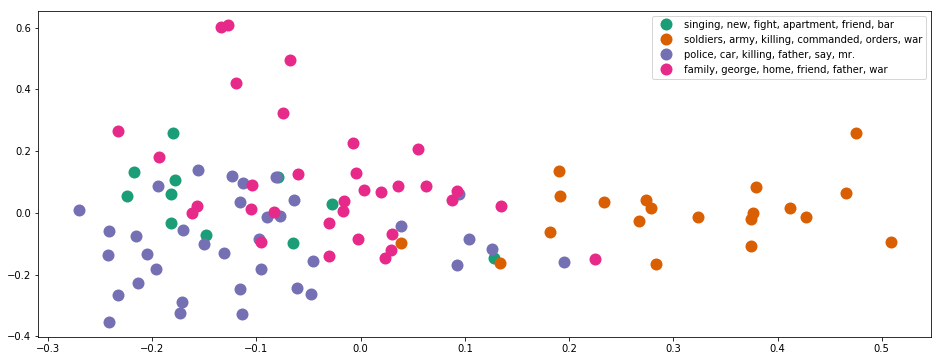

# Document Clustering and Topic Modeling

In this project, I use unsupervised learning models to cluster unlabeled synopses of Top 100 [Greatest Movies of All Time from IMDB](https://www.imdb.com/list/ls055592025/) into different groups, visualize the results and identify their latent topics/structures.

## Contents

<ul>
<li>[Part 1: Load Data](#Part-1:-Load-Data)
<li>[Part 2: Tokenizing and Stemming](#Part-2:-Tokenizing-and-Stemming)
<li>[Part 3: TF-IDF](#Part-3:-TF-IDF)
<li>[Part 4: K-means clustering](#Part-4:-K-means-clustering)
<li>[Part 5: Topic Modeling - Latent Dirichlet Allocation](#Part-5:-Topic-Modeling---Latent-Dirichlet-Allocation)
</ul>

# Part 1: Load Data


```python
import warnings
warnings.filterwarnings('ignore')
import numpy as np
import pandas as pd
import nltk
import re
import os

from sklearn import decomposition
from sklearn.feature_extraction.text import TfidfVectorizer
import matplotlib.pyplot as plt
import lda
```

Read data from files. In summary, the data have 100 titles and 100 synoposes (combined from imdb and wiki).


```python
#import three lists: titles and wikipedia synopses
titles = open('input/title_list.txt').read().split('\n')
titles = titles[:100] #ensures that only the first 100 are read in

#The wiki synopses and imdb synopses of each movie is seperated by the keywords "BREAKS HERE". 
#Each synoposes may consist of multiple paragraphs.
synopses_wiki = open('input/synopses_list_wiki.txt').read().split('\n BREAKS HERE')
synopses_wiki = synopses_wiki[:100]

synopses_imdb = open('input/synopses_list_imdb.txt').read().split('\n BREAKS HERE')
synopses_imdb = synopses_imdb[:100]

#Combine imdb and wiki to get full synoposes for the top 100 movies. 
synopses = []
for i in range(len(synopses_wiki)):
    item = synopses_wiki[i] + synopses_imdb[i]
    synopses.append(item)
    
#Because these synopses have already been ordered in popularity order, 
#just need to generate a list of ordered numbers for future usage.
ranks = range(1, len(titles)+1)
```

# Part 2: Tokenizing and Stemming

Load stopwords and stemmer function from NLTK library.
Stop words are words like "a", "the", or "in" which don't convey significant meaning.
Stemming is the process of breaking a word down into its root.


```python
# Use nltk's English stopwords.
stopwords = nltk.corpus.stopwords.words('english')

print("We use " + str(len(stopwords)) + " stop-words from nltk library.")
print(stopwords[:10])
```

    We use 153 stop-words from nltk library.
    ['i', 'me', 'my', 'myself', 'we', 'our', 'ours', 'ourselves', 'you', 'your']


```python
from nltk.stem.snowball import SnowballStemmer
stemmer = SnowballStemmer("english")

def tokenization_and_stemming(text):
    tokens = [word.lower() for sent in nltk.sent_tokenize(text) for word in nltk.word_tokenize(sent) if word not in stopwords]
#     tokens=[]
#     for sent in nltk.sent_tokenize(text):
#         for word in nltk.word_tokenize(sent):
#             if word not in stopwords:
#                 tokens.append(word);   
    filtered_tokens = []
    # filter out any tokens not containing letters (e.g., numeric tokens, raw punctuation)
    for token in tokens:
        if re.search('[a-zA-Z]', token):
            filtered_tokens.append(token)
    stems = [stemmer.stem(t) for t in filtered_tokens]
    return stems

def tokenization(text):
    tokens = [word.lower() for sent in nltk.sent_tokenize(text) for word in nltk.word_tokenize(sent) if word not in stopwords]
    filtered_tokens = []
    for token in tokens:
        if re.search('[a-zA-Z]', token):
            filtered_tokens.append(token)
    return filtered_tokens
```


```python
tokenization_and_stemming("she looked at her father's arm.")
```


    ['look', 'father', "'s", 'arm']


Use the defined functions to analyze (i.e. tokenize, stem) our synoposes.


```python
docs_stemmed = []
docs_tokenized = []
for i in synopses:
    tokenized_and_stemmed_results = tokenization_and_stemming(i)
    docs_stemmed.extend(tokenized_and_stemmed_results)
    
    tokenized_results = tokenization(i)
    docs_tokenized.extend(tokenized_results)
```

Create a mapping from stemmed words to original tokenized words for result interpretation.


```python
vocab_frame_dict = {docs_stemmed[x]:docs_tokenized[x] for x in range(len(docs_stemmed))}
print(vocab_frame_dict['angel'])
```

    angeles


# Part 3: TF-IDF


```python
#define vectorizer parameters
tfidf_model = TfidfVectorizer(max_df=0.8, max_features=200000,
                                 min_df=0.2, stop_words='english',
                                 use_idf=True, tokenizer=tokenization_and_stemming, ngram_range=(1,1))

tfidf_matrix = tfidf_model.fit_transform(synopses) #fit the vectorizer to synopses

print("In total, there are " + str(tfidf_matrix.shape[0]) + \
      " synoposes and " + str(tfidf_matrix.shape[1]) + " terms.")
```

    In total, there are 100 synoposes and 538 terms.


```python
tfidf_model.get_params()
```


    {'analyzer': 'word',
     'binary': False,
     'decode_error': 'strict',
     'dtype': numpy.int64,
     'encoding': 'utf-8',
     'input': 'content',
     'lowercase': True,
     'max_df': 0.8,
     'max_features': 200000,
     'min_df': 0.2,
     'ngram_range': (1, 1),
     'norm': 'l2',
     'preprocessor': None,
     'smooth_idf': True,
     'stop_words': 'english',
     'strip_accents': None,
     'sublinear_tf': False,
     'token_pattern': '(?u)\\b\\w\\w+\\b',
     'tokenizer': <function __main__.tokenization_and_stemming(text)>,
     'use_idf': True,
     'vocabulary': None}


Save the terms identified by TF-IDF.


```python
tf_selected_words = tfidf_model.get_feature_names()
```

# Calculate Document Similarity


```python
from sklearn.metrics.pairwise import cosine_similarity
cos_matrix = cosine_similarity(tfidf_matrix)
print(cos_matrix)
```

    [[1.         0.1996283  0.23342595 ... 0.3581728  0.3277855  0.17714484]
     [0.1996283  1.         0.26626879 ... 0.26910321 0.22856581 0.10870124]
     [0.23342595 0.26626879 1.         ... 0.27738654 0.24669308 0.12805055]
     ...
     [0.3581728  0.26910321 0.27738654 ... 1.         0.55040973 0.08151334]
     [0.3277855  0.22856581 0.24669308 ... 0.55040973 1.         0.13005234]
     [0.17714484 0.10870124 0.12805055 ... 0.08151334 0.13005234 1.        ]]


# Part 4: K-means clustering


```python
from sklearn.cluster import KMeans

num_clusters = 4
km = KMeans(n_clusters=num_clusters)
km.fit(tfidf_matrix)
clusters = km.labels_.tolist()
```

## 4.1. Analyze K-means Result


```python
# create DataFrame films from all of the input files.
films = { 'title': titles, 'rank': ranks, 'synopsis': synopses, 'cluster': clusters}
frame = pd.DataFrame(films, index = [clusters] , columns = ['rank', 'title', 'cluster'])
```


```python
frame.head(10)
```


<div>
<style scoped>
    .dataframe tbody tr th:only-of-type {
        vertical-align: middle;
    }

    .dataframe tbody tr th {
        vertical-align: top;
    }

    .dataframe thead th {
        text-align: right;
    }
</style>
<table border="1" class="dataframe">
  <thead>
    <tr style="text-align: right;">
      <th></th>
      <th>rank</th>
      <th>title</th>
      <th>cluster</th>
    </tr>
  </thead>
  <tbody>
    <tr>
      <th>3</th>
      <td>1</td>
      <td>The Godfather</td>
      <td>3</td>
    </tr>
    <tr>
      <th>3</th>
      <td>2</td>
      <td>The Shawshank Redemption</td>
      <td>3</td>
    </tr>
    <tr>
      <th>1</th>
      <td>3</td>
      <td>Schindler's List</td>
      <td>1</td>
    </tr>
    <tr>
      <th>0</th>
      <td>4</td>
      <td>Raging Bull</td>
      <td>0</td>
    </tr>
    <tr>
      <th>2</th>
      <td>5</td>
      <td>Casablanca</td>
      <td>2</td>
    </tr>
    <tr>
      <th>1</th>
      <td>6</td>
      <td>One Flew Over the Cuckoo's Nest</td>
      <td>1</td>
    </tr>
    <tr>
      <th>3</th>
      <td>7</td>
      <td>Gone with the Wind</td>
      <td>3</td>
    </tr>
    <tr>
      <th>2</th>
      <td>8</td>
      <td>Citizen Kane</td>
      <td>2</td>
    </tr>
    <tr>
      <th>3</th>
      <td>9</td>
      <td>The Wizard of Oz</td>
      <td>3</td>
    </tr>
    <tr>
      <th>3</th>
      <td>10</td>
      <td>Titanic</td>
      <td>3</td>
    </tr>
  </tbody>
</table>
</div>


```python
print("Number of films included in each cluster:")
frame['cluster'].value_counts().to_frame()
```

    Number of films included in each cluster:


<div>
<style scoped>
    .dataframe tbody tr th:only-of-type {
        vertical-align: middle;
    }

    .dataframe tbody tr th {
        vertical-align: top;
    }

    .dataframe thead th {
        text-align: right;
    }
</style>
<table border="1" class="dataframe">
  <thead>
    <tr style="text-align: right;">
      <th></th>
      <th>cluster</th>
    </tr>
  </thead>
  <tbody>
    <tr>
      <th>2</th>
      <td>36</td>
    </tr>
    <tr>
      <th>3</th>
      <td>33</td>
    </tr>
    <tr>
      <th>1</th>
      <td>20</td>
    </tr>
    <tr>
      <th>0</th>
      <td>11</td>
    </tr>
  </tbody>
</table>
</div>


```python
grouped = frame['rank'].groupby(frame['cluster'])
print("Average rank (1 to 100) per cluster:")
grouped.mean().to_frame()
```

    Average rank (1 to 100) per cluster:


<div>
<style scoped>
    .dataframe tbody tr th:only-of-type {
        vertical-align: middle;
    }

    .dataframe tbody tr th {
        vertical-align: top;
    }

    .dataframe thead th {
        text-align: right;
    }
</style>
<table border="1" class="dataframe">
  <thead>
    <tr style="text-align: right;">
      <th></th>
      <th>rank</th>
    </tr>
    <tr>
      <th>cluster</th>
      <th></th>
    </tr>
  </thead>
  <tbody>
    <tr>
      <th>0</th>
      <td>46.545455</td>
    </tr>
    <tr>
      <th>1</th>
      <td>42.950000</td>
    </tr>
    <tr>
      <th>2</th>
      <td>59.583333</td>
    </tr>
    <tr>
      <th>3</th>
      <td>46.484848</td>
    </tr>
  </tbody>
</table>
</div>


```python
print("<Document clustering result by K-means>")

#km.cluster_centers_ denotes the importances of each items in centroid.
#We need to sort it in decreasing-order and get the top k items.
order_centroids = km.cluster_centers_.argsort()[:, ::-1] 

Cluster_keywords_summary = {}
for i in range(num_clusters):
    print("Cluster " + str(i) + " words:" ,)
    Cluster_keywords_summary[i] = []
    for ind in order_centroids[i, :6]: #replace 6 with n words per cluster
        Cluster_keywords_summary[i].append(vocab_frame_dict[tf_selected_words[ind]])
        print(vocab_frame_dict[tf_selected_words[ind]] + ",")
    print
    #Here ix means index, which is the clusterID of each item.
    #Without tolist, the values result from dataframe is <type 'numpy.ndarray'>
    cluster_movies = frame.ix[i]['title'].values.tolist()
    print("Cluster " + str(i) + " titles (" + str(len(cluster_movies)) + " movies): " )
    print(", ".join(cluster_movies))
```

    <Document clustering result by K-means>
    Cluster 0 words:
    singing,
    new,
    fight,
    apartment,
    friend,
    bar,
    Cluster 0 titles (11 movies): 
    Raging Bull, On the Waterfront, Singin' in the Rain, Rocky, An American in Paris, Jaws, The Good, the Bad and the Ugly, The Apartment, Midnight Cowboy, Annie Hall, Nashville
    Cluster 1 words:
    soldiers,
    army,
    killing,
    commanded,
    orders,
    war,
    Cluster 1 titles (20 movies): 
    Schindler's List, One Flew Over the Cuckoo's Nest, Lawrence of Arabia, The Bridge on the River Kwai, Dr. Strangelove or: How I Learned to Stop Worrying and Love the Bomb, Apocalypse Now, The Lord of the Rings: The Return of the King, Gladiator, From Here to Eternity, Saving Private Ryan, Raiders of the Lost Ark, Patton, Braveheart, Butch Cassidy and the Sundance Kid, Platoon, Dances with Wolves, The Deer Hunter, All Quiet on the Western Front, Stagecoach, Mutiny on the Bounty
    Cluster 2 words:
    police,
    car,
    killing,
    father,
    say,
    mr.,
    Cluster 2 titles (36 movies): 
    Casablanca, Citizen Kane, Psycho, Sunset Blvd., Vertigo, West Side Story, Chinatown, Some Like It Hot, 12 Angry Men, Amadeus, Gandhi, Unforgiven, To Kill a Mockingbird, My Fair Lady, The Treasure of the Sierra Madre, High Noon, The Exorcist, The French Connection, City Lights, It Happened One Night, Out of Africa, Fargo, Shane, The Graduate, American Graffiti, Pulp Fiction, The African Queen, The Maltese Falcon, A Clockwork Orange, Taxi Driver, Wuthering Heights, Double Indemnity, Rebel Without a Cause, Rear Window, The Third Man, North by Northwest
    Cluster 3 words:
    family,
    george,
    home,
    friend,
    father,
    war,
    Cluster 3 titles (33 movies): 
    The Godfather, The Shawshank Redemption, Gone with the Wind, The Wizard of Oz, Titanic, The Godfather: Part II, Forrest Gump, The Sound of Music, Star Wars, E.T. the Extra-Terrestrial, 2001: A Space Odyssey, The Silence of the Lambs, It's a Wonderful Life, A Streetcar Named Desire, The Philadelphia Story, The Best Years of Our Lives, Ben-Hur, Doctor Zhivago, The Pianist, Goodfellas, The King's Speech, A Place in the Sun, Mr. Smith Goes to Washington, Rain Man, Good Will Hunting, Terms of Endearment, Tootsie, Giant, The Grapes of Wrath, The Green Mile, Close Encounters of the Third Kind, Network, Yankee Doodle Dandy


It shows that the main topics of the 4 clusters of movies are:
killing, family, wars & love

## 4.2. Plot K-means Result


```python
# use PCA to visualize the 2 principle components. 
pca = decomposition.PCA(n_components=2)
tfidf_matrix_np=tfidf_matrix.toarray()
pca.fit(tfidf_matrix_np)
X = pca.transform(tfidf_matrix_np)

xs, ys = X[:, 0], X[:, 1]

#set up colors per clusters using a dict
cluster_colors = {0: '#1b9e77', 1: '#d95f02', 2: '#7570b3', 3: '#e7298a', 4: '#66a61e'}
#set up cluster names using a dict
cluster_names = {}
for i in range(num_clusters):
    cluster_names[i] = ", ".join(Cluster_keywords_summary[i])
```


```python
%matplotlib inline 

#create data frame with PCA cluster results
df = pd.DataFrame(dict(x=xs, y=ys, label=clusters, title=titles)) 
groups = df.groupby(clusters)

# set up plot
fig, ax = plt.subplots(figsize=(16, 6))
#Set color for each cluster/group
for name, group in groups:
    ax.plot(group.x, group.y, marker='o', linestyle='', ms=12, 
            label=cluster_names[name], color=cluster_colors[name], 
            mec='none')

ax.legend(numpoints=1,loc=1)  #show legend with only 1 point, position is upper right. 

plt.show() #show the plot
```





# Part 5: Topic Modeling - Latent Dirichlet Allocation
I will use LDA to group the movies.


```python
#Now use synopses to build a 100*551 matrix (terms)
terms_dict = {tf_selected_words[x]:x for x in range(len(tf_selected_words))}

feature_matrix_synopses_tf = []
for i in synopses:
    current_doc_stats = [0] * len(tf_selected_words)
    allwords_stemmed = tokenization_and_stemming(i)
    for get_terms in allwords_stemmed:
        if get_terms in tf_selected_words:
            current_doc_stats[terms_dict[get_terms]] += 1
    current_doc_stats = np.asarray(current_doc_stats)
    feature_matrix_synopses_tf.append(current_doc_stats)
    
feature_matrix_synopses_tf = np.asarray(feature_matrix_synopses_tf)
```


```python
model = lda.LDA(n_topics=4, n_iter=500, random_state=42)
```

<li> "model.topic_word_" saves the importance of tf_selected_words in LDA model, i.e. words similarity matrix
<li> The shape of "model.topic_word_" is (n_topics,num_of_selected_words)
<li> "model.doc_topic_" saves the document topic results, i.e. document topic matrix.
<li> The shape of "model.doc_topic_" is (num_of_documents, n_topics)


```python
model.fit(feature_matrix_synopses_tf)
topic_word = model.topic_word_  # model.components_ also works
n_top_words = 7

topic_keywords_list = []
for i, topic_dist in enumerate(topic_word):
    #Here we select top(n_top_words-1)
    lda_topic_words = np.array(tf_selected_words)[np.argsort(topic_dist)][:-n_top_words:-1] 
    for j in range(len(lda_topic_words)):
        lda_topic_words[j] = vocab_frame_dict[lda_topic_words[j]]
    topic_keywords_list.append(lda_topic_words.tolist())
```

    INFO:lda:n_documents: 100
    INFO:lda:vocab_size: 538
    INFO:lda:n_words: 61218
    INFO:lda:n_topics: 4
    INFO:lda:n_iter: 500
    INFO:lda:<0> log likelihood: -468275
    INFO:lda:<10> log likelihood: -419126
    INFO:lda:<20> log likelihood: -406304
    INFO:lda:<30> log likelihood: -401554
    INFO:lda:<40> log likelihood: -397861
    INFO:lda:<50> log likelihood: -395310
    INFO:lda:<60> log likelihood: -394295
    INFO:lda:<70> log likelihood: -393199
    INFO:lda:<80> log likelihood: -392362
    INFO:lda:<90> log likelihood: -391746
    INFO:lda:<100> log likelihood: -391167
    INFO:lda:<110> log likelihood: -391029
    INFO:lda:<120> log likelihood: -390754
    INFO:lda:<130> log likelihood: -389672
    INFO:lda:<140> log likelihood: -389680
    INFO:lda:<150> log likelihood: -389629
    INFO:lda:<160> log likelihood: -389268
    INFO:lda:<170> log likelihood: -389463
    INFO:lda:<180> log likelihood: -389061
    INFO:lda:<190> log likelihood: -389237
    INFO:lda:<200> log likelihood: -389228
    INFO:lda:<210> log likelihood: -388704
    INFO:lda:<220> log likelihood: -388672
    INFO:lda:<230> log likelihood: -388748
    INFO:lda:<240> log likelihood: -388627
    INFO:lda:<250> log likelihood: -387824
    INFO:lda:<260> log likelihood: -387258
    INFO:lda:<270> log likelihood: -387927
    INFO:lda:<280> log likelihood: -388226
    INFO:lda:<290> log likelihood: -388128
    INFO:lda:<300> log likelihood: -387900
    INFO:lda:<310> log likelihood: -387717
    INFO:lda:<320> log likelihood: -388069
    INFO:lda:<330> log likelihood: -387946
    INFO:lda:<340> log likelihood: -387700
    INFO:lda:<350> log likelihood: -387335
    INFO:lda:<360> log likelihood: -387190
    INFO:lda:<370> log likelihood: -387131
    INFO:lda:<380> log likelihood: -387149
    INFO:lda:<390> log likelihood: -387062
    INFO:lda:<400> log likelihood: -386498
    INFO:lda:<410> log likelihood: -386736
    INFO:lda:<420> log likelihood: -386692
    INFO:lda:<430> log likelihood: -386681
    INFO:lda:<440> log likelihood: -387017
    INFO:lda:<450> log likelihood: -386409
    INFO:lda:<460> log likelihood: -386703
    INFO:lda:<470> log likelihood: -386477
    INFO:lda:<480> log likelihood: -387068
    INFO:lda:<490> log likelihood: -386490
    INFO:lda:<499> log likelihood: -386251


```python
doc_topic = model.doc_topic_
topic_doc_dict = {}

print("<Document clustering result by LDA>")
for i in range(len(doc_topic)):
    topicID = doc_topic[i].argmax()
    if topicID not in topic_doc_dict:
        topic_doc_dict[topicID] = [titles[i]]
    else:
        topic_doc_dict[topicID].append(titles[i])
for i in topic_doc_dict:
    print('==============================')
    print("Cluster " + str(i) + " words: " + ", ".join(topic_keywords_list[i]))
    print("Cluster " + str(i) + " titles (" + str(len(topic_doc_dict[i])) + " movies): " )
    print(', '.join(topic_doc_dict[i]))
```

    <Document clustering result by LDA>
    ==============================
    Cluster 1 words: father, family, george, love, working, filmed
    Cluster 1 titles (24 movies): 
    The Godfather, Raging Bull, Gone with the Wind, Citizen Kane, The Godfather: Part II, The Sound of Music, Singin' in the Rain, It's a Wonderful Life, Amadeus, Gandhi, A Streetcar Named Desire, The Philadelphia Story, An American in Paris, The Best Years of Our Lives, Braveheart, City Lights, The King's Speech, A Place in the Sun, Mr. Smith Goes to Washington, Annie Hall, Good Will Hunting, Terms of Endearment, Giant, Yankee Doodle Dandy
    ==============================
    Cluster 3 words: asks, say, n't, killing, friend, goes
    Cluster 3 titles (33 movies): 
    The Shawshank Redemption, Casablanca, One Flew Over the Cuckoo's Nest, Psycho, On the Waterfront, West Side Story, 2001: A Space Odyssey, Chinatown, Some Like It Hot, 12 Angry Men, Unforgiven, Rocky, To Kill a Mockingbird, Jaws, The Apartment, The Deer Hunter, Tootsie, Fargo, The Grapes of Wrath, Shane, The Green Mile, Close Encounters of the Third Kind, Nashville, American Graffiti, Pulp Fiction, The Maltese Falcon, A Clockwork Orange, Taxi Driver, Double Indemnity, Rebel Without a Cause, Rear Window, The Third Man, North by Northwest
    ==============================
    Cluster 0 words: killing, orders, men, soldiers, army, war
    Cluster 0 titles (17 movies): 
    Schindler's List, Lawrence of Arabia, Star Wars, The Bridge on the River Kwai, Dr. Strangelove or: How I Learned to Stop Worrying and Love the Bomb, Apocalypse Now, The Lord of the Rings: The Return of the King, Gladiator, From Here to Eternity, Saving Private Ryan, Raiders of the Lost Ark, Patton, Platoon, Dances with Wolves, All Quiet on the Western Front, Stagecoach, Mutiny on the Bounty
    ==============================
    Cluster 2 words: run, away, helping, home, way, discover
    Cluster 2 titles (26 movies): 
    The Wizard of Oz, Titanic, Sunset Blvd., Vertigo, Forrest Gump, E.T. the Extra-Terrestrial, The Silence of the Lambs, My Fair Lady, Ben-Hur, Doctor Zhivago, The Good, the Bad and the Ugly, Butch Cassidy and the Sundance Kid, The Treasure of the Sierra Madre, High Noon, The Pianist, Goodfellas, The Exorcist, The French Connection, It Happened One Night, Midnight Cowboy, Rain Man, Out of Africa, Network, The Graduate, The African Queen, Wuthering Heights

